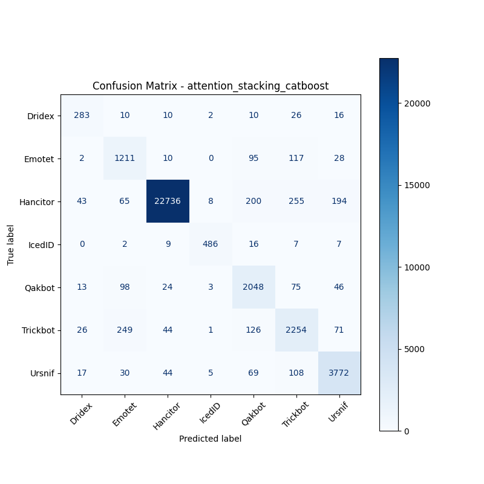

# 融合方式: attention+stacking (catboost)

**Test Accuracy:** 0.9376

**Macro F1:** 0.8610

**分类报告:**

              precision    recall  f1-score   support

           0     0.7370    0.7927    0.7638       357
           1     0.7273    0.8278    0.7743      1463
           2     0.9938    0.9674    0.9805     23501
           3     0.9624    0.9222    0.9419       527
           4     0.7988    0.8877    0.8409      2307
           5     0.7931    0.8134    0.8031      2771
           6     0.9124    0.9325    0.9224      4045

    accuracy                         0.9376     34971
   macro avg     0.8464    0.8777    0.8610     34971
weighted avg     0.9414    0.9376    0.9391     34971

**混淆矩阵:**

[[  283    10    10     2    10    26    16]
 [    2  1211    10     0    95   117    28]
 [   43    65 22736     8   200   255   194]
 [    0     2     9   486    16     7     7]
 [   13    98    24     3  2048    75    46]
 [   26   249    44     1   126  2254    71]
 [   17    30    44     5    69   108  3772]]

