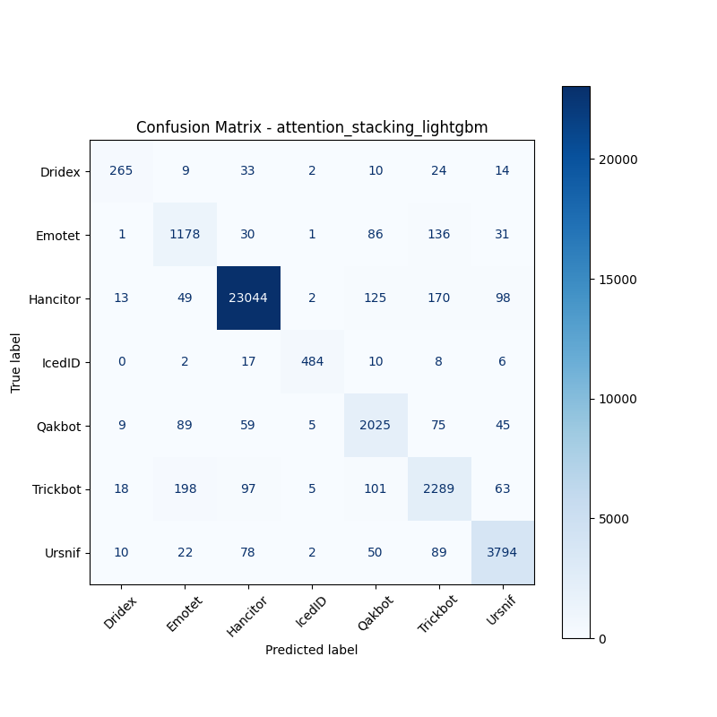

# 融合方式: attention+stacking (lightgbm)

**Test Accuracy:** 0.9459

**Macro F1:** 0.8736

**分类报告:**

              precision    recall  f1-score   support

           0     0.8386    0.7423    0.7875       357
           1     0.7615    0.8052    0.7827      1463
           2     0.9866    0.9806    0.9835     23501
           3     0.9661    0.9184    0.9416       527
           4     0.8413    0.8778    0.8591      2307
           5     0.8201    0.8261    0.8231      2771
           6     0.9366    0.9379    0.9373      4045

    accuracy                         0.9459     34971
   macro avg     0.8787    0.8697    0.8736     34971
weighted avg     0.9468    0.9459    0.9462     34971

**混淆矩阵:**

[[  265     9    33     2    10    24    14]
 [    1  1178    30     1    86   136    31]
 [   13    49 23044     2   125   170    98]
 [    0     2    17   484    10     8     6]
 [    9    89    59     5  2025    75    45]
 [   18   198    97     5   101  2289    63]
 [   10    22    78     2    50    89  3794]]

