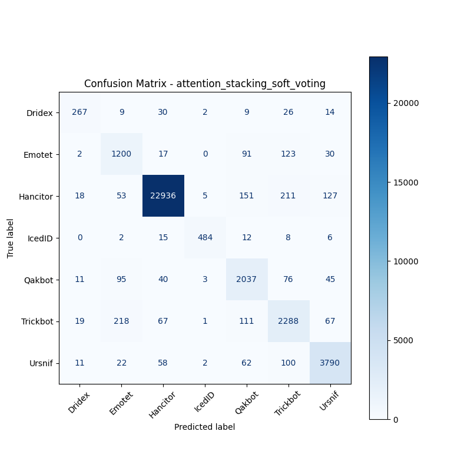

# 融合方式: attention+stacking (soft_voting)

**Test Accuracy:** 0.9437

**Macro F1:** 0.8705

**分类报告:**

              precision    recall  f1-score   support

           0     0.8140    0.7479    0.7796       357
           1     0.7505    0.8202    0.7838      1463
           2     0.9902    0.9760    0.9830     23501
           3     0.9738    0.9184    0.9453       527
           4     0.8237    0.8830    0.8523      2307
           5     0.8079    0.8257    0.8167      2771
           6     0.9291    0.9370    0.9330      4045

    accuracy                         0.9437     34971
   macro avg     0.8699    0.8726    0.8705     34971
weighted avg     0.9456    0.9437    0.9445     34971

**混淆矩阵:**

[[  267     9    30     2     9    26    14]
 [    2  1200    17     0    91   123    30]
 [   18    53 22936     5   151   211   127]
 [    0     2    15   484    12     8     6]
 [   11    95    40     3  2037    76    45]
 [   19   218    67     1   111  2288    67]
 [   11    22    58     2    62   100  3790]]

