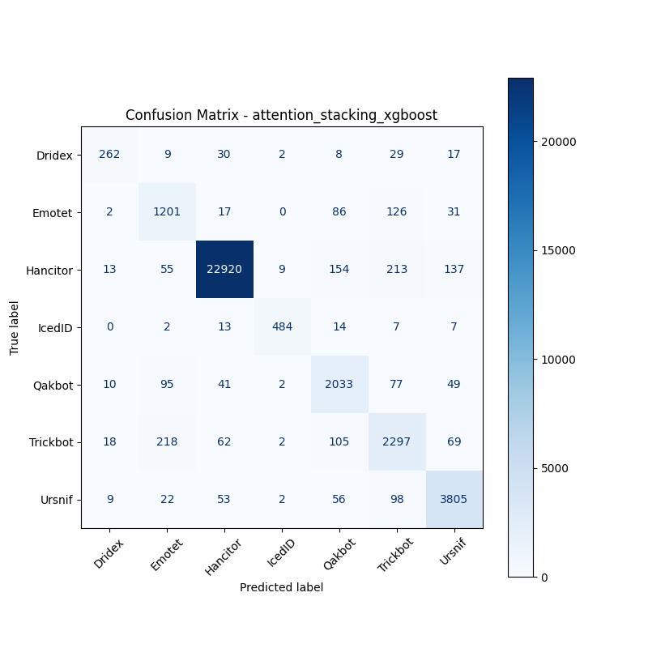
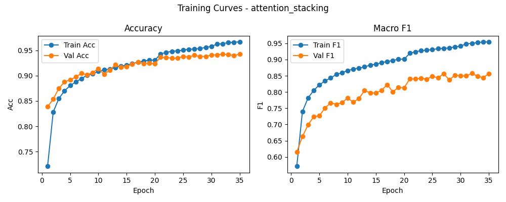

# 融合方式: attention+stacking (xgboost)

**Test Accuracy:** 0.9437

**Macro F1:** 0.8704

**分类报告:**

              precision    recall  f1-score   support

           0     0.8344    0.7339    0.7809       357
           1     0.7497    0.8209    0.7837      1463
           2     0.9907    0.9753    0.9829     23501
           3     0.9661    0.9184    0.9416       527
           4     0.8278    0.8812    0.8537      2307
           5     0.8068    0.8289    0.8177      2771
           6     0.9247    0.9407    0.9326      4045

    accuracy                         0.9437     34971
   macro avg     0.8714    0.8713    0.8704     34971
weighted avg     0.9457    0.9437    0.9445     34971

**混淆矩阵:**

[[  262     9    30     2     8    29    17]
 [    2  1201    17     0    86   126    31]
 [   13    55 22920     9   154   213   137]
 [    0     2    13   484    14     7     7]
 [   10    95    41     2  2033    77    49]
 [   18   218    62     2   105  2297    69]
 [    9    22    53     2    56    98  3805]]

