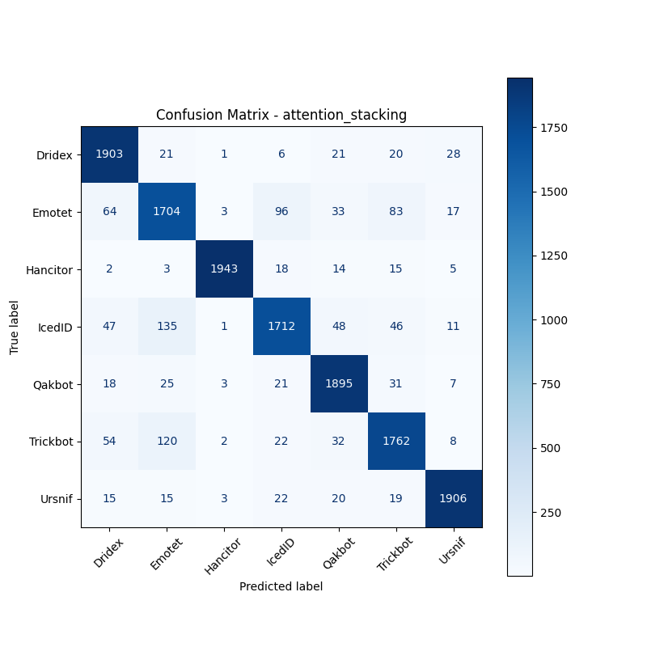

# 融合方式: attention+stacking (attention_stacking)

**Test Accuracy:** 0.9161

**Macro F1:** 0.9160

**分类报告:**

              precision    recall  f1-score   support

           0     0.9049    0.9515    0.9276      2000
           1     0.8423    0.8520    0.8471      2000
           2     0.9934    0.9715    0.9823      2000
           3     0.9025    0.8560    0.8786      2000
           4     0.9186    0.9475    0.9328      2000
           5     0.8917    0.8810    0.8863      2000
           6     0.9617    0.9530    0.9573      2000

    accuracy                         0.9161     14000
   macro avg     0.9164    0.9161    0.9160     14000
weighted avg     0.9164    0.9161    0.9160     14000

**混淆矩阵:**

[[1903   21    1    6   21   20   28]
 [  64 1704    3   96   33   83   17]
 [   2    3 1943   18   14   15    5]
 [  47  135    1 1712   48   46   11]
 [  18   25    3   21 1895   31    7]
 [  54  120    2   22   32 1762    8]
 [  15   15    3   22   20   19 1906]]

