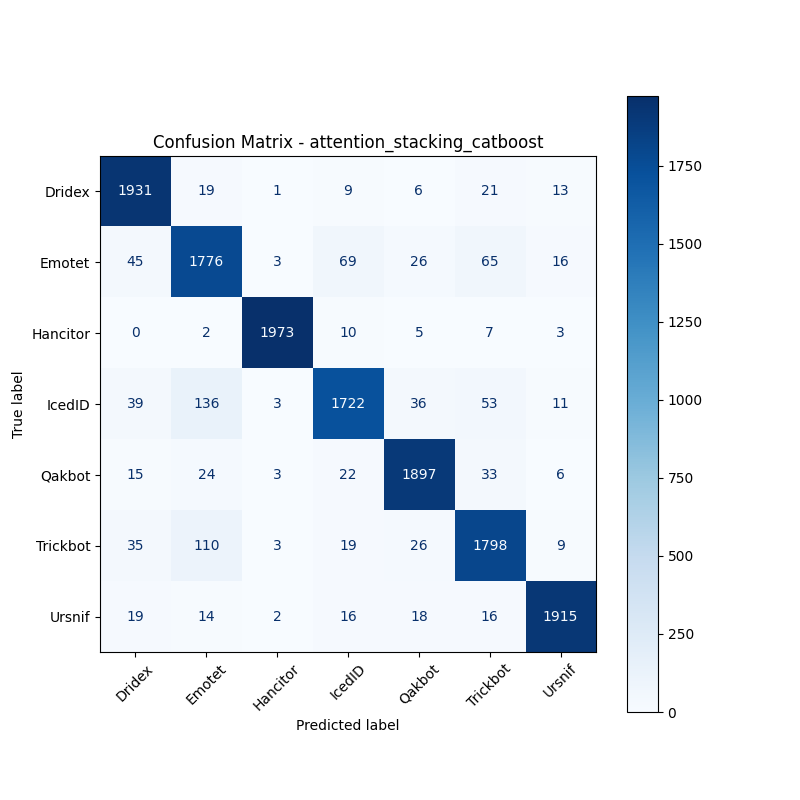

# 融合方式: attention+stacking (catboost)

**Test Accuracy:** 0.9294

**Macro F1:** 0.9294

**分类报告:**

              precision    recall  f1-score   support

           0     0.9266    0.9655    0.9456      2000
           1     0.8534    0.8880    0.8704      2000
           2     0.9925    0.9865    0.9895      2000
           3     0.9223    0.8610    0.8906      2000
           4     0.9419    0.9485    0.9452      2000
           5     0.9022    0.8990    0.9006      2000
           6     0.9706    0.9575    0.9640      2000

    accuracy                         0.9294     14000
   macro avg     0.9299    0.9294    0.9294     14000
weighted avg     0.9299    0.9294    0.9294     14000

**混淆矩阵:**

[[1931   19    1    9    6   21   13]
 [  45 1776    3   69   26   65   16]
 [   0    2 1973   10    5    7    3]
 [  39  136    3 1722   36   53   11]
 [  15   24    3   22 1897   33    6]
 [  35  110    3   19   26 1798    9]
 [  19   14    2   16   18   16 1915]]

