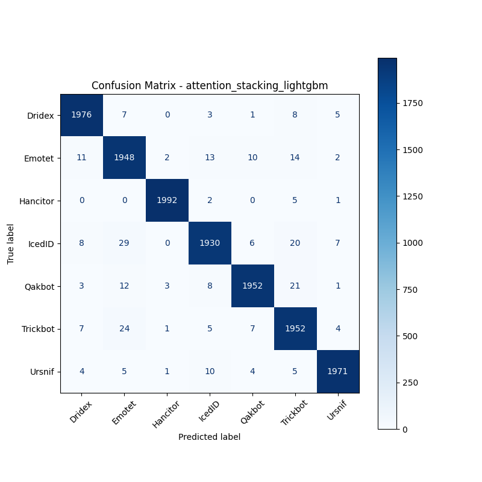

# 融合方式: attention+stacking (lightgbm)

**Test Accuracy:** 0.9801

**Macro F1:** 0.9801

**分类报告:**

              precision    recall  f1-score   support

           0     0.9836    0.9880    0.9858      2000
           1     0.9620    0.9740    0.9680      2000
           2     0.9965    0.9960    0.9962      2000
           3     0.9792    0.9650    0.9720      2000
           4     0.9859    0.9760    0.9809      2000
           5     0.9640    0.9760    0.9699      2000
           6     0.9900    0.9855    0.9877      2000

    accuracy                         0.9801     14000
   macro avg     0.9801    0.9801    0.9801     14000
weighted avg     0.9801    0.9801    0.9801     14000

**混淆矩阵:**

[[1976    7    0    3    1    8    5]
 [  11 1948    2   13   10   14    2]
 [   0    0 1992    2    0    5    1]
 [   8   29    0 1930    6   20    7]
 [   3   12    3    8 1952   21    1]
 [   7   24    1    5    7 1952    4]
 [   4    5    1   10    4    5 1971]]

