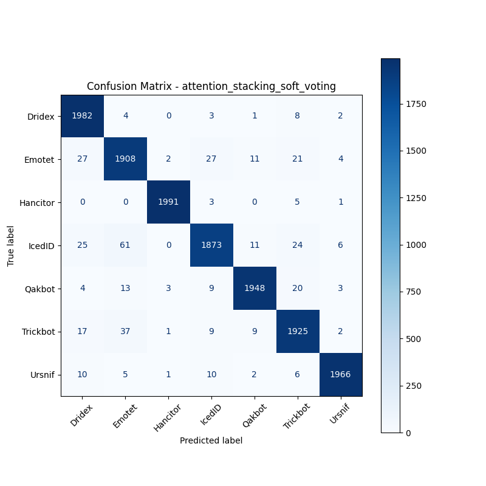
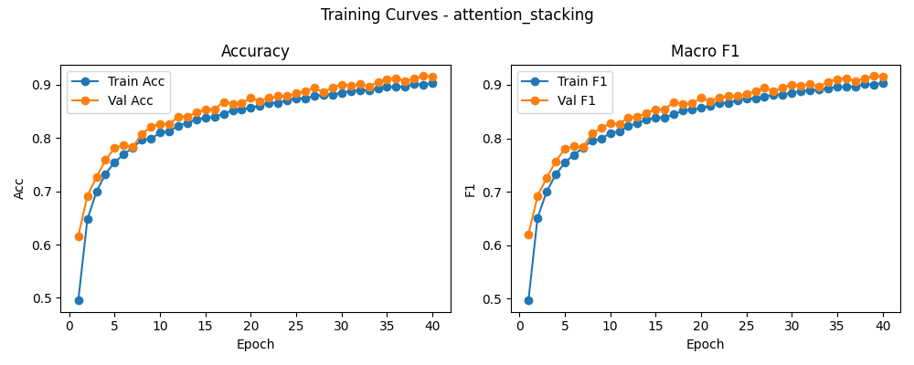

# 融合方式: attention+stacking (soft_voting)

**Test Accuracy:** 0.9709

**Macro F1:** 0.9709

**分类报告:**

              precision    recall  f1-score   support

           0     0.9598    0.9910    0.9752      2000
           1     0.9408    0.9540    0.9474      2000
           2     0.9965    0.9955    0.9960      2000
           3     0.9685    0.9365    0.9522      2000
           4     0.9828    0.9740    0.9784      2000
           5     0.9582    0.9625    0.9603      2000
           6     0.9909    0.9830    0.9869      2000

    accuracy                         0.9709     14000
   macro avg     0.9711    0.9709    0.9709     14000
weighted avg     0.9711    0.9709    0.9709     14000

**混淆矩阵:**

[[1982    4    0    3    1    8    2]
 [  27 1908    2   27   11   21    4]
 [   0    0 1991    3    0    5    1]
 [  25   61    0 1873   11   24    6]
 [   4   13    3    9 1948   20    3]
 [  17   37    1    9    9 1925    2]
 [  10    5    1   10    2    6 1966]]

