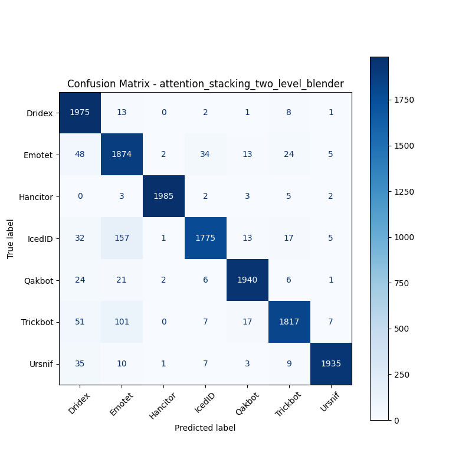

# 融合方式: attention+stacking (two_level_blender)

**Test Accuracy:** 0.9501

**Macro F1:** 0.9503

**分类报告:**

              precision    recall  f1-score   support

           0     0.9122    0.9875    0.9484      2000
           1     0.8600    0.9370    0.8969      2000
           2     0.9970    0.9925    0.9947      2000
           3     0.9684    0.8875    0.9262      2000
           4     0.9749    0.9700    0.9724      2000
           5     0.9634    0.9085    0.9352      2000
           6     0.9893    0.9675    0.9783      2000

    accuracy                         0.9501     14000
   macro avg     0.9522    0.9501    0.9503     14000
weighted avg     0.9522    0.9501    0.9503     14000

**混淆矩阵:**

[[1975   13    0    2    1    8    1]
 [  48 1874    2   34   13   24    5]
 [   0    3 1985    2    3    5    2]
 [  32  157    1 1775   13   17    5]
 [  24   21    2    6 1940    6    1]
 [  51  101    0    7   17 1817    7]
 [  35   10    1    7    3    9 1935]]

