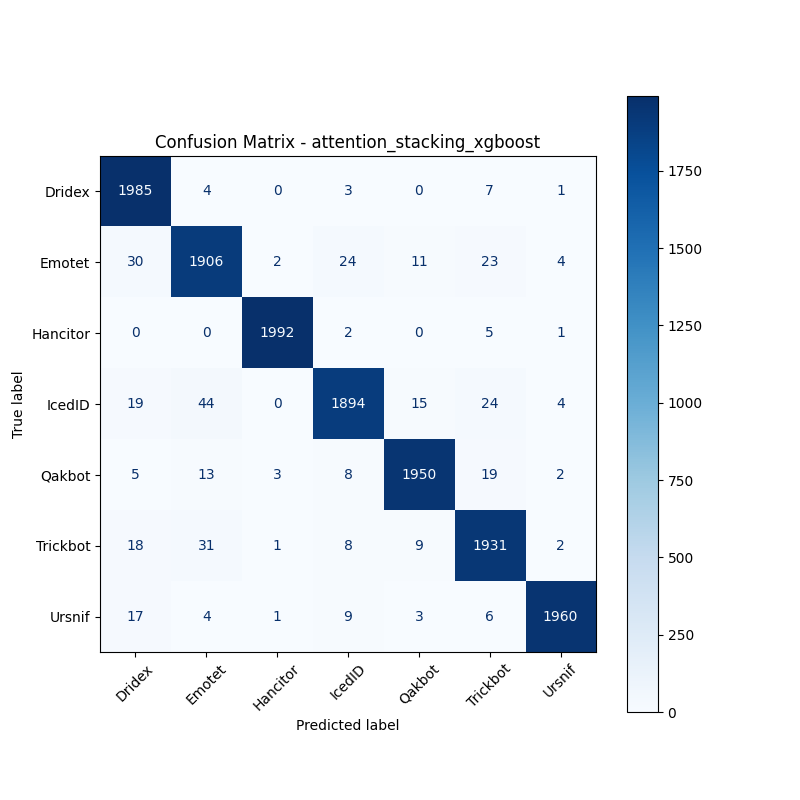

# 融合方式: attention+stacking (xgboost)

**Test Accuracy:** 0.9727

**Macro F1:** 0.9727

**分类报告:**

              precision    recall  f1-score   support

           0     0.9571    0.9925    0.9745      2000
           1     0.9520    0.9530    0.9525      2000
           2     0.9965    0.9960    0.9962      2000
           3     0.9723    0.9470    0.9595      2000
           4     0.9809    0.9750    0.9779      2000
           5     0.9583    0.9655    0.9619      2000
           6     0.9929    0.9800    0.9864      2000

    accuracy                         0.9727     14000
   macro avg     0.9729    0.9727    0.9727     14000
weighted avg     0.9729    0.9727    0.9727     14000

**混淆矩阵:**

[[1985    4    0    3    0    7    1]
 [  30 1906    2   24   11   23    4]
 [   0    0 1992    2    0    5    1]
 [  19   44    0 1894   15   24    4]
 [   5   13    3    8 1950   19    2]
 [  18   31    1    8    9 1931    2]
 [  17    4    1    9    3    6 1960]]

