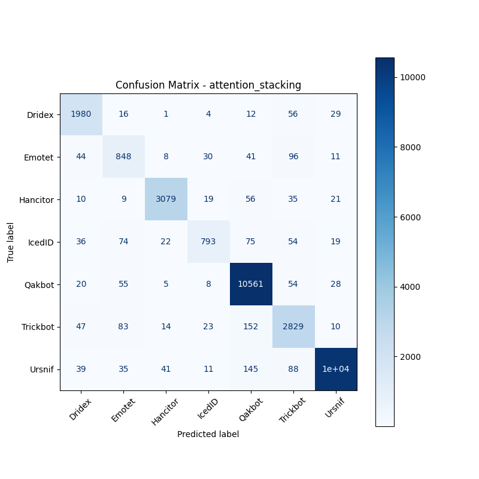

# 融合方式: attention+stacking (attention_stacking)

**Test Accuracy:** 0.9490

**Macro F1:** 0.9007

**分类报告:**

              precision    recall  f1-score   support

           0     0.9099    0.9438    0.9265      2098
           1     0.7571    0.7866    0.7716      1078
           2     0.9713    0.9535    0.9623      3229
           3     0.8930    0.7390    0.8088      1073
           4     0.9564    0.9842    0.9701     10731
           5     0.8808    0.8958    0.8882      3158
           6     0.9887    0.9664    0.9774     10683

    accuracy                         0.9490     32050
   macro avg     0.9082    0.8956    0.9007     32050
weighted avg     0.9494    0.9490    0.9488     32050

**混淆矩阵:**

[[ 1980    16     1     4    12    56    29]
 [   44   848     8    30    41    96    11]
 [   10     9  3079    19    56    35    21]
 [   36    74    22   793    75    54    19]
 [   20    55     5     8 10561    54    28]
 [   47    83    14    23   152  2829    10]
 [   39    35    41    11   145    88 10324]]

