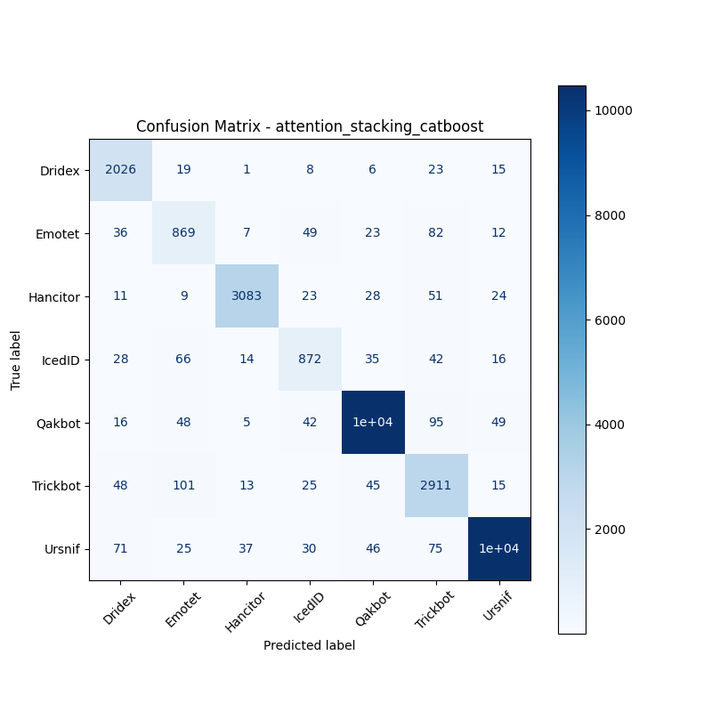

# 融合方式: attention+stacking (catboost)

**Test Accuracy:** 0.9559

**Macro F1:** 0.9101

**分类报告:**

              precision    recall  f1-score   support

           0     0.9061    0.9657    0.9349      2098
           1     0.7643    0.8061    0.7847      1078
           2     0.9756    0.9548    0.9651      3229
           3     0.8313    0.8127    0.8219      1073
           4     0.9828    0.9762    0.9795     10731
           5     0.8878    0.9218    0.9045      3158
           6     0.9876    0.9734    0.9804     10683

    accuracy                         0.9559     32050
   macro avg     0.9051    0.9158    0.9101     32050
weighted avg     0.9569    0.9559    0.9562     32050

**混淆矩阵:**

[[ 2026    19     1     8     6    23    15]
 [   36   869     7    49    23    82    12]
 [   11     9  3083    23    28    51    24]
 [   28    66    14   872    35    42    16]
 [   16    48     5    42 10476    95    49]
 [   48   101    13    25    45  2911    15]
 [   71    25    37    30    46    75 10399]]

