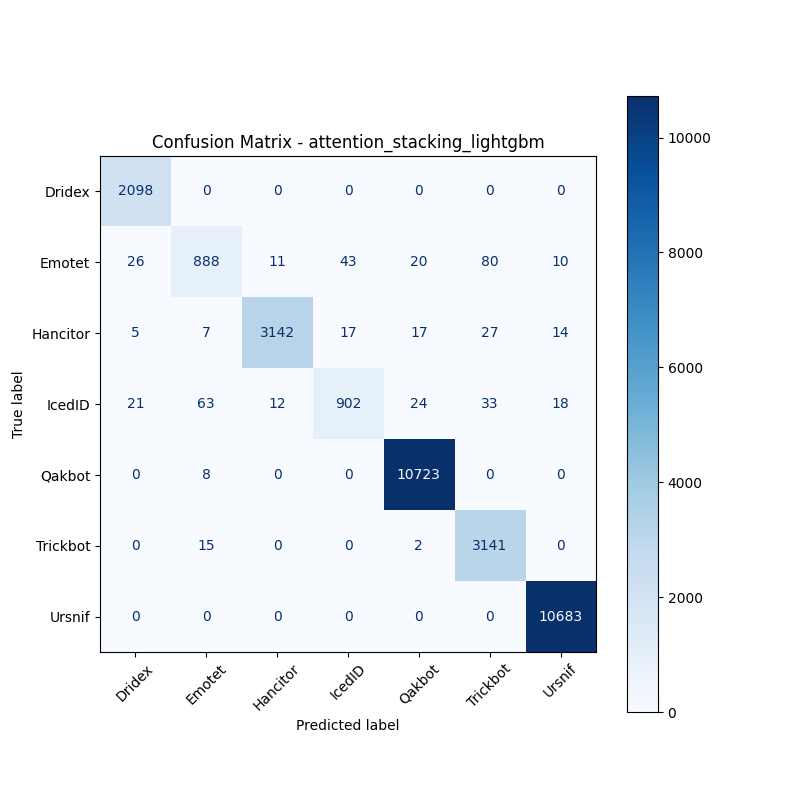

# 融合方式: attention+stacking (lightgbm)

**Test Accuracy:** 0.9852

**Macro F1:** 0.9557

**分类报告:**

              precision    recall  f1-score   support

           0     0.9758    1.0000    0.9878      2098
           1     0.9052    0.8237    0.8626      1078
           2     0.9927    0.9731    0.9828      3229
           3     0.9376    0.8406    0.8865      1073
           4     0.9942    0.9993    0.9967     10731
           5     0.9573    0.9946    0.9756      3158
           6     0.9961    1.0000    0.9980     10683

    accuracy                         0.9852     32050
   macro avg     0.9656    0.9473    0.9557     32050
weighted avg     0.9849    0.9852    0.9849     32050

**混淆矩阵:**

[[ 2098     0     0     0     0     0     0]
 [   26   888    11    43    20    80    10]
 [    5     7  3142    17    17    27    14]
 [   21    63    12   902    24    33    18]
 [    0     8     0     0 10723     0     0]
 [    0    15     0     0     2  3141     0]
 [    0     0     0     0     0     0 10683]]

