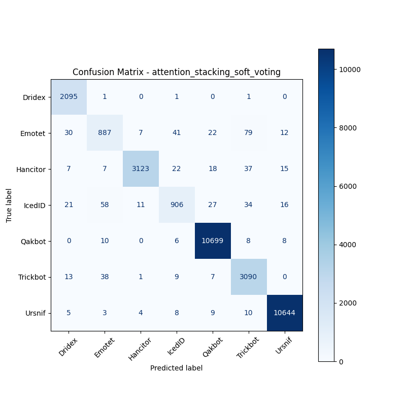

# 融合方式: attention+stacking (soft_voting)

**Test Accuracy:** 0.9811

**Macro F1:** 0.9491

**分类报告:**

              precision    recall  f1-score   support

           0     0.9650    0.9986    0.9815      2098
           1     0.8835    0.8228    0.8521      1078
           2     0.9927    0.9672    0.9798      3229
           3     0.9124    0.8444    0.8771      1073
           4     0.9923    0.9970    0.9947     10731
           5     0.9481    0.9785    0.9631      3158
           6     0.9952    0.9963    0.9958     10683

    accuracy                         0.9811     32050
   macro avg     0.9556    0.9435    0.9491     32050
weighted avg     0.9808    0.9811    0.9808     32050

**混淆矩阵:**

[[ 2095     1     0     1     0     1     0]
 [   30   887     7    41    22    79    12]
 [    7     7  3123    22    18    37    15]
 [   21    58    11   906    27    34    16]
 [    0    10     0     6 10699     8     8]
 [   13    38     1     9     7  3090     0]
 [    5     3     4     8     9    10 10644]]

