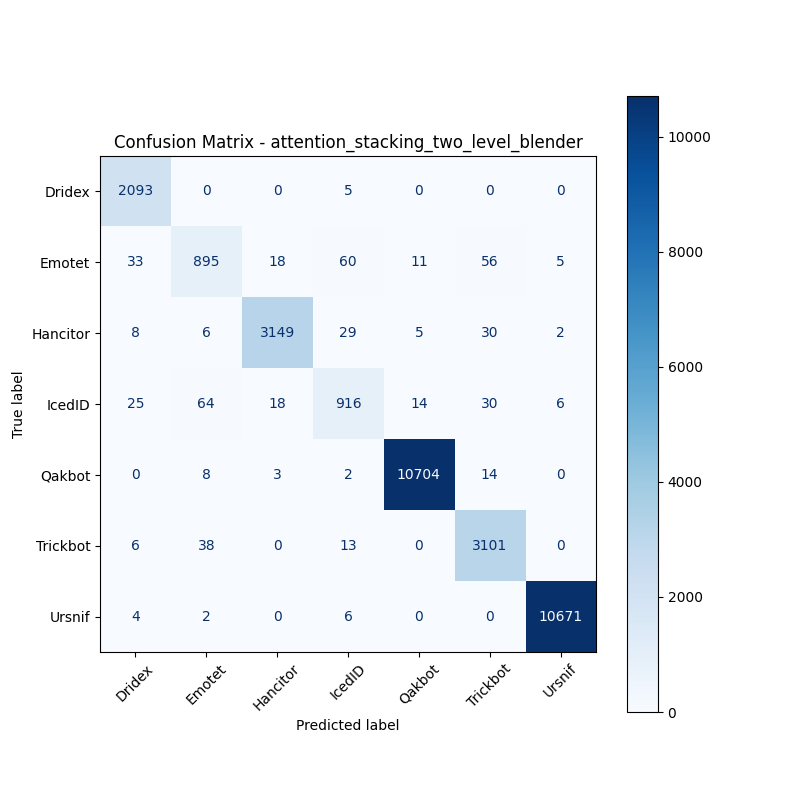

# 融合方式: attention+stacking (two_level_blender)

**Test Accuracy:** 0.9837

**Macro F1:** 0.9509

**分类报告:**

              precision    recall  f1-score   support

           0     0.9650    0.9976    0.9810      2098
           1     0.8835    0.8302    0.8560      1078
           2     0.9878    0.9752    0.9815      3229
           3     0.8885    0.8537    0.8707      1073
           4     0.9972    0.9975    0.9973     10731
           5     0.9598    0.9820    0.9707      3158
           6     0.9988    0.9989    0.9988     10683

    accuracy                         0.9837     32050
   macro avg     0.9544    0.9479    0.9509     32050
weighted avg     0.9835    0.9837    0.9836     32050

**混淆矩阵:**

[[ 2093     0     0     5     0     0     0]
 [   33   895    18    60    11    56     5]
 [    8     6  3149    29     5    30     2]
 [   25    64    18   916    14    30     6]
 [    0     8     3     2 10704    14     0]
 [    6    38     0    13     0  3101     0]
 [    4     2     0     6     0     0 10671]]

