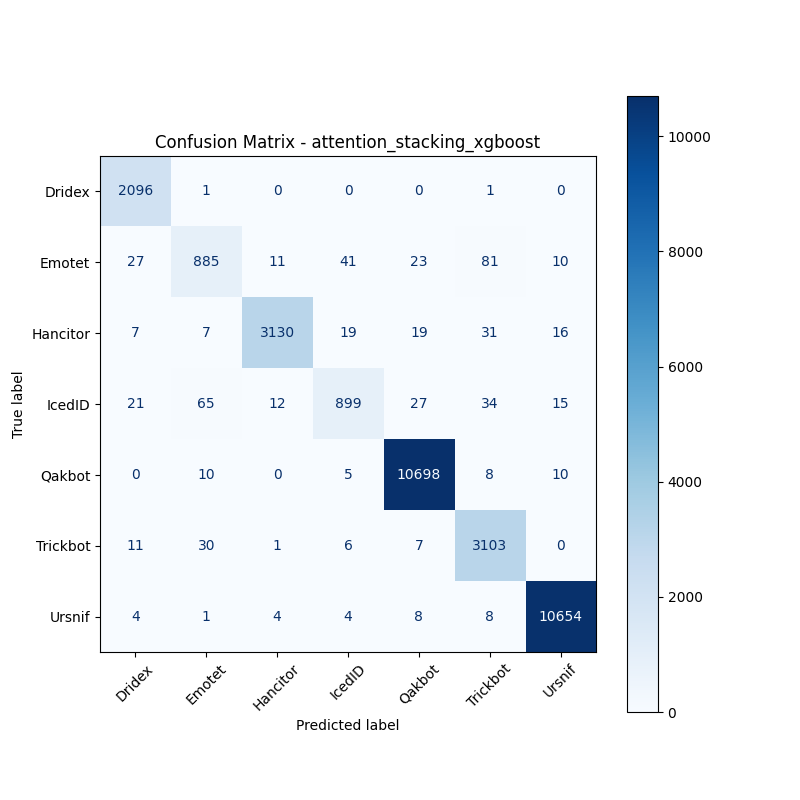
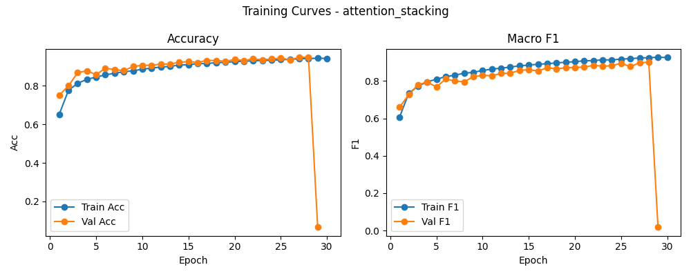

# 融合方式: attention+stacking (xgboost)

**Test Accuracy:** 0.9817

**Macro F1:** 0.9501

**分类报告:**

              precision    recall  f1-score   support

           0     0.9677    0.9990    0.9831      2098
           1     0.8859    0.8210    0.8522      1078
           2     0.9911    0.9693    0.9801      3229
           3     0.9230    0.8378    0.8784      1073
           4     0.9922    0.9969    0.9946     10731
           5     0.9501    0.9826    0.9661      3158
           6     0.9952    0.9973    0.9963     10683

    accuracy                         0.9817     32050
   macro avg     0.9579    0.9434    0.9501     32050
weighted avg     0.9815    0.9817    0.9814     32050

**混淆矩阵:**

[[ 2096     1     0     0     0     1     0]
 [   27   885    11    41    23    81    10]
 [    7     7  3130    19    19    31    16]
 [   21    65    12   899    27    34    15]
 [    0    10     0     5 10698     8    10]
 [   11    30     1     6     7  3103     0]
 [    4     1     4     4     8     8 10654]]

