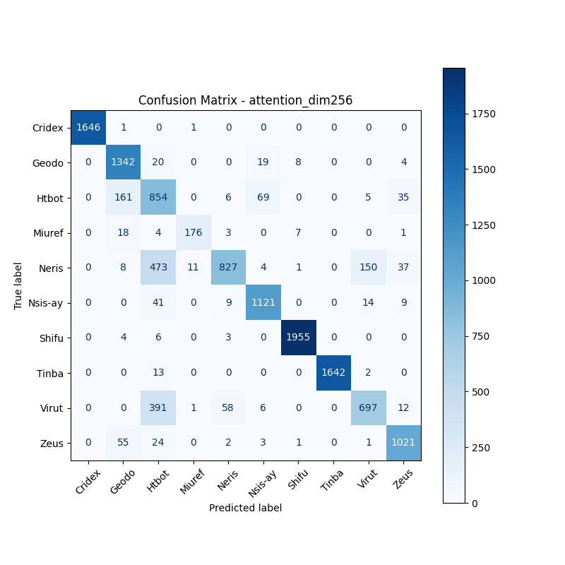

# 融合方式: attention

**Test Accuracy:** 0.8690

**Macro F1:** 0.8564

**分类报告:**

              precision    recall  f1-score   support

           0     1.0000    0.9988    0.9994      1648
           1     0.8446    0.9634    0.9001      1393
           2     0.4677    0.7558    0.5778      1130
           3     0.9312    0.8421    0.8844       209
           4     0.9108    0.5473    0.6838      1511
           5     0.9173    0.9389    0.9280      1194
           6     0.9914    0.9934    0.9924      1968
           7     1.0000    0.9909    0.9955      1657
           8     0.8021    0.5983    0.6853      1165
           9     0.9124    0.9223    0.9173      1107

    accuracy                         0.8690     12982
   macro avg     0.8777    0.8551    0.8564     12982
weighted avg     0.8914    0.8690    0.8701     12982

**混淆矩阵:**

[[1646    1    0    1    0    0    0    0    0    0]
 [   0 1342   20    0    0   19    8    0    0    4]
 [   0  161  854    0    6   69    0    0    5   35]
 [   0   18    4  176    3    0    7    0    0    1]
 [   0    8  473   11  827    4    1    0  150   37]
 [   0    0   41    0    9 1121    0    0   14    9]
 [   0    4    6    0    3    0 1955    0    0    0]
 [   0    0   13    0    0    0    0 1642    2    0]
 [   0    0  391    1   58    6    0    0  697   12]
 [   0   55   24    0    2    3    1    0    1 1021]]

