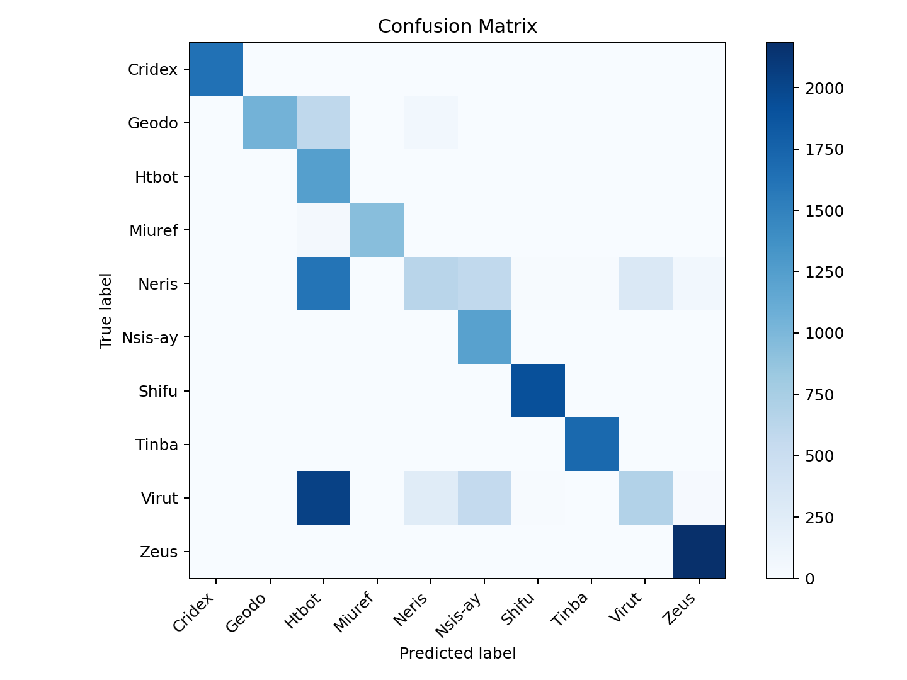
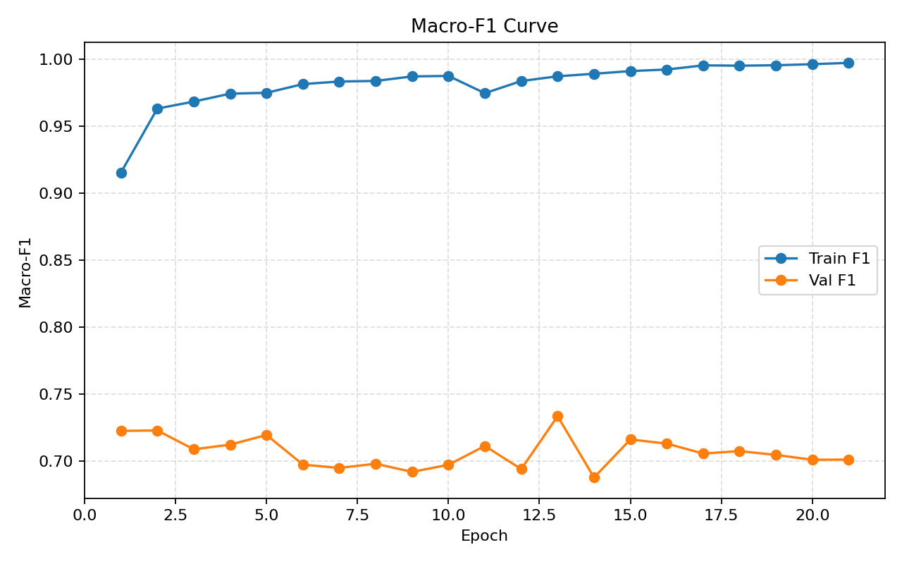

# 融合方式: attention

**Test Accuracy:** 0.6790

**Macro F1:** 0.7337

**分类报告:**

```
precision    recall  f1-score   support

      Cridex     0.9994    0.9957    0.9976      1642
       Geodo     1.0000    0.6104    0.7581      1712
       Htbot     0.2231    0.9912    0.3642      1246
      Miuref     0.9989    0.9482    0.9729       984
       Neris     0.6590    0.1962    0.3023      3232
     Nsis-ay     0.5186    1.0000    0.6830      1214
       Shifu     0.9856    0.9964    0.9909      1920
       Tinba     0.9872    1.0000    0.9936      1700
       Virut     0.6767    0.1902    0.2969      3555
        Zeus     0.9583    0.9973    0.9774      2191

    accuracy                         0.6790     19396
   macro avg     0.8007    0.7925    0.7337     19396
weighted avg     0.7965    0.6790    0.6672     19396
```

**混淆矩阵:**

```
[[1635    0    6    0    0    0    0    1    0    0]
 [   0 1045  597    0   68    0    0    0    0    2]
 [   0    0 1235    0    3    0    5    0    0    3]
 [   0    0   43  933    1    0    0    1    0    6]
 [   1    0 1609    0  634  572   12   17  323   64]
 [   0    0    0    0    0 1214    0    0    0    0]
 [   0    0    6    0    0    0 1913    0    0    1]
 [   0    0    0    0    0    0    0 1700    0    0]
 [   0    0 2034    1  256  555   11    3  676   19]
 [   0    0    6    0    0    0    0    0    0 2185]]
```



