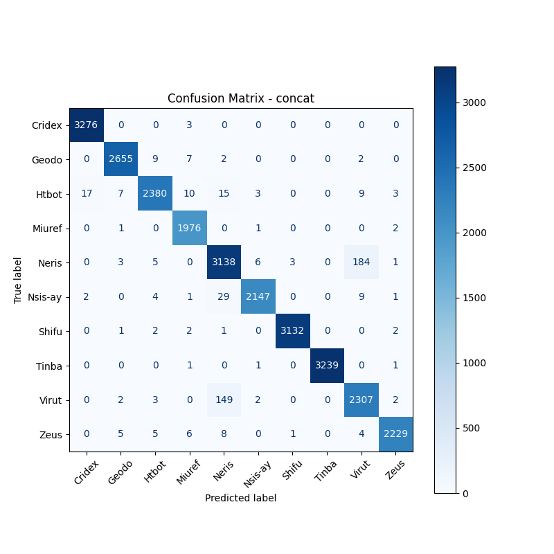
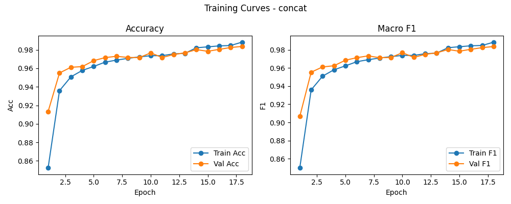

# 融合方式: concat

**Test Accuracy:** 0.9801

**Macro F1:** 0.9803

**分类报告:**

              precision    recall  f1-score   support

           0     0.9942    0.9991    0.9967      3279
           1     0.9929    0.9925    0.9927      2675
           2     0.9884    0.9738    0.9810      2444
           3     0.9850    0.9980    0.9915      1980
           4     0.9390    0.9395    0.9392      3340
           5     0.9940    0.9790    0.9864      2193
           6     0.9987    0.9975    0.9981      3140
           7     1.0000    0.9991    0.9995      3242
           8     0.9173    0.9359    0.9265      2465
           9     0.9946    0.9872    0.9909      2258

    accuracy                         0.9801     27016
   macro avg     0.9804    0.9802    0.9803     27016
weighted avg     0.9803    0.9801    0.9802     27016

**混淆矩阵:**

[[3276    0    0    3    0    0    0    0    0    0]
 [   0 2655    9    7    2    0    0    0    2    0]
 [  17    7 2380   10   15    3    0    0    9    3]
 [   0    1    0 1976    0    1    0    0    0    2]
 [   0    3    5    0 3138    6    3    0  184    1]
 [   2    0    4    1   29 2147    0    0    9    1]
 [   0    1    2    2    1    0 3132    0    0    2]
 [   0    0    0    1    0    1    0 3239    0    1]
 [   0    2    3    0  149    2    0    0 2307    2]
 [   0    5    5    6    8    0    1    0    4 2229]]

