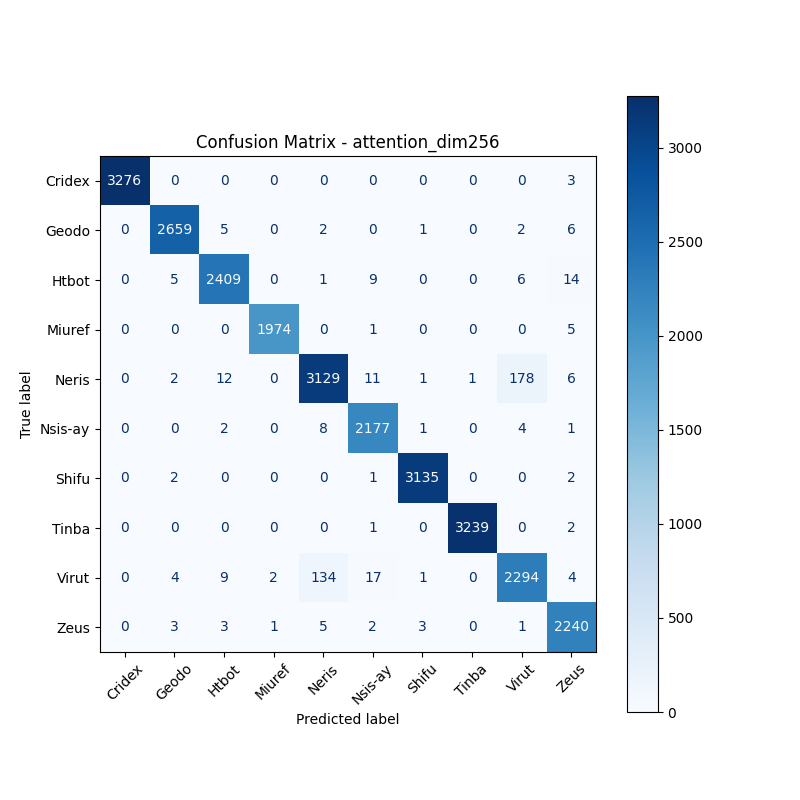
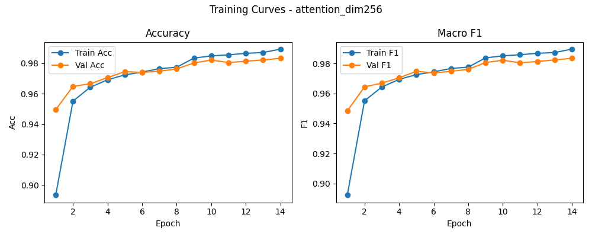

# 融合方式: attention

**Test Accuracy:** 0.9821

**Macro F1:** 0.9821

**分类报告:**

              precision    recall  f1-score   support

           0     1.0000    0.9991    0.9995      3279
           1     0.9940    0.9940    0.9940      2675
           2     0.9873    0.9857    0.9865      2444
           3     0.9985    0.9970    0.9977      1980
           4     0.9543    0.9368    0.9455      3340
           5     0.9811    0.9927    0.9869      2193
           6     0.9978    0.9984    0.9981      3140
           7     0.9997    0.9991    0.9994      3242
           8     0.9231    0.9306    0.9269      2465
           9     0.9812    0.9920    0.9866      2258

    accuracy                         0.9821     27016
   macro avg     0.9817    0.9825    0.9821     27016
weighted avg     0.9821    0.9821    0.9821     27016

**混淆矩阵:**

[[3276    0    0    0    0    0    0    0    0    3]
 [   0 2659    5    0    2    0    1    0    2    6]
 [   0    5 2409    0    1    9    0    0    6   14]
 [   0    0    0 1974    0    1    0    0    0    5]
 [   0    2   12    0 3129   11    1    1  178    6]
 [   0    0    2    0    8 2177    1    0    4    1]
 [   0    2    0    0    0    1 3135    0    0    2]
 [   0    0    0    0    0    1    0 3239    0    2]
 [   0    4    9    2  134   17    1    0 2294    4]
 [   0    3    3    1    5    2    3    0    1 2240]]

