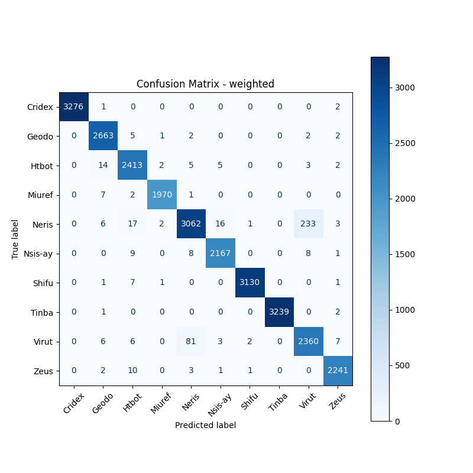
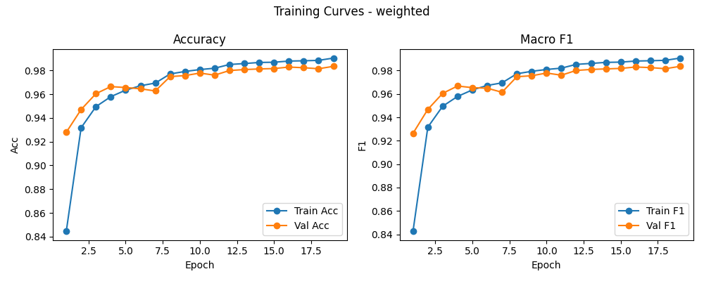

# 融合方式: weighted

**Test Accuracy:** 0.9817

**Macro F1:** 0.9819

**分类报告:**

              precision    recall  f1-score   support

           0     1.0000    0.9991    0.9995      3279
           1     0.9859    0.9955    0.9907      2675
           2     0.9773    0.9873    0.9823      2444
           3     0.9970    0.9949    0.9960      1980
           4     0.9684    0.9168    0.9419      3340
           5     0.9886    0.9881    0.9884      2193
           6     0.9987    0.9968    0.9978      3140
           7     1.0000    0.9991    0.9995      3242
           8     0.9056    0.9574    0.9308      2465
           9     0.9912    0.9925    0.9918      2258

    accuracy                         0.9817     27016
   macro avg     0.9813    0.9828    0.9819     27016
weighted avg     0.9820    0.9817    0.9817     27016

**混淆矩阵:**

[[3276    1    0    0    0    0    0    0    0    2]
 [   0 2663    5    1    2    0    0    0    2    2]
 [   0   14 2413    2    5    5    0    0    3    2]
 [   0    7    2 1970    1    0    0    0    0    0]
 [   0    6   17    2 3062   16    1    0  233    3]
 [   0    0    9    0    8 2167    0    0    8    1]
 [   0    1    7    1    0    0 3130    0    0    1]
 [   0    1    0    0    0    0    0 3239    0    2]
 [   0    6    6    0   81    3    2    0 2360    7]
 [   0    2   10    0    3    1    1    0    0 2241]]

