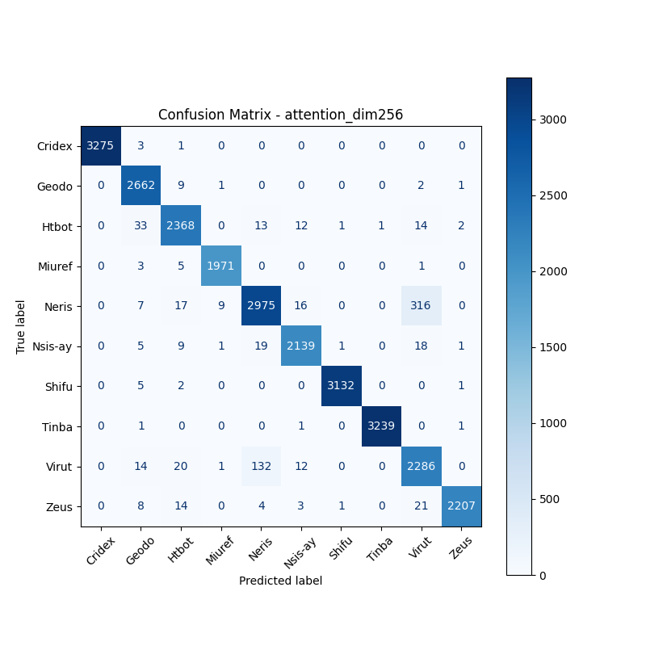
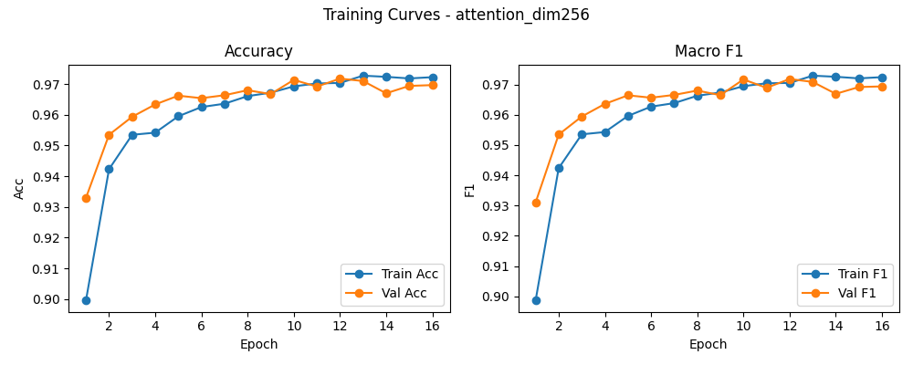

# 融合方式: attention

**Test Accuracy:** 0.9718

**Macro F1:** 0.9719

**分类报告:**

              precision    recall  f1-score   support

           0     1.0000    0.9988    0.9994      3279
           1     0.9712    0.9951    0.9830      2675
           2     0.9685    0.9689    0.9687      2444
           3     0.9939    0.9955    0.9947      1980
           4     0.9465    0.8907    0.9178      3340
           5     0.9798    0.9754    0.9776      2193
           6     0.9990    0.9975    0.9982      3140
           7     0.9997    0.9991    0.9994      3242
           8     0.8600    0.9274    0.8924      2465
           9     0.9973    0.9774    0.9873      2258

    accuracy                         0.9718     27016
   macro avg     0.9716    0.9726    0.9719     27016
weighted avg     0.9725    0.9718    0.9719     27016

**混淆矩阵:**

[[3275    3    1    0    0    0    0    0    0    0]
 [   0 2662    9    1    0    0    0    0    2    1]
 [   0   33 2368    0   13   12    1    1   14    2]
 [   0    3    5 1971    0    0    0    0    1    0]
 [   0    7   17    9 2975   16    0    0  316    0]
 [   0    5    9    1   19 2139    1    0   18    1]
 [   0    5    2    0    0    0 3132    0    0    1]
 [   0    1    0    0    0    1    0 3239    0    1]
 [   0   14   20    1  132   12    0    0 2286    0]
 [   0    8   14    0    4    3    1    0   21 2207]]

