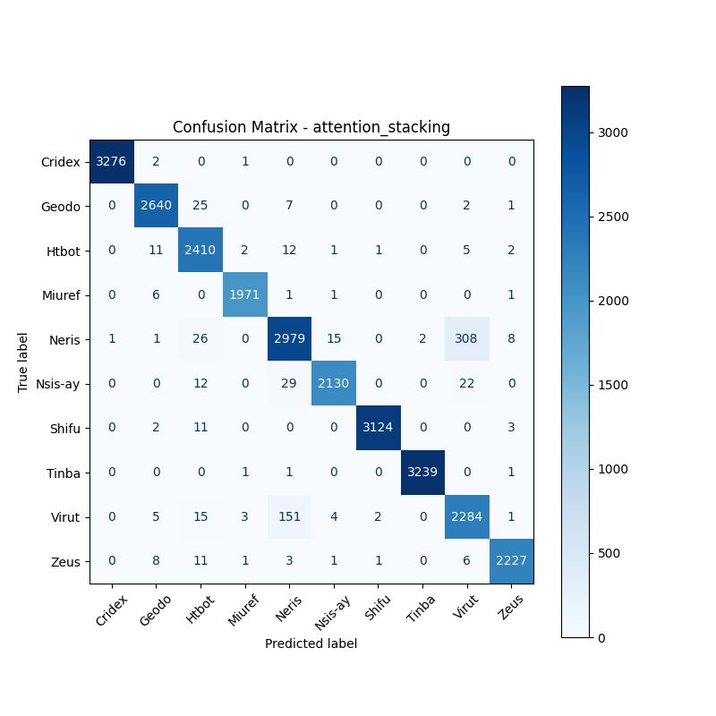
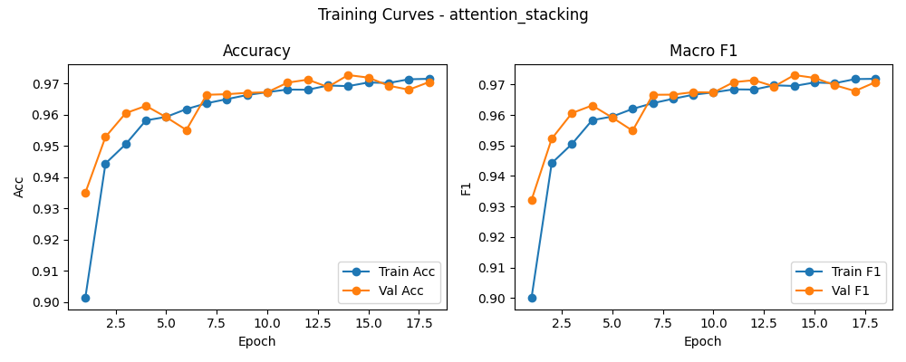

# 融合方式: attention+stacking (attention_stacking)

**Test Accuracy:** 0.9728

**Macro F1:** 0.9731

**分类报告:**

              precision    recall  f1-score   support

           0     0.9997    0.9991    0.9994      3279
           1     0.9869    0.9869    0.9869      2675
           2     0.9602    0.9861    0.9730      2444
           3     0.9960    0.9955    0.9957      1980
           4     0.9359    0.8919    0.9134      3340
           5     0.9898    0.9713    0.9804      2193
           6     0.9987    0.9949    0.9968      3140
           7     0.9994    0.9991    0.9992      3242
           8     0.8694    0.9266    0.8971      2465
           9     0.9924    0.9863    0.9893      2258

    accuracy                         0.9728     27016
   macro avg     0.9728    0.9738    0.9731     27016
weighted avg     0.9732    0.9728    0.9728     27016

**混淆矩阵:**

[[3276    2    0    1    0    0    0    0    0    0]
 [   0 2640   25    0    7    0    0    0    2    1]
 [   0   11 2410    2   12    1    1    0    5    2]
 [   0    6    0 1971    1    1    0    0    0    1]
 [   1    1   26    0 2979   15    0    2  308    8]
 [   0    0   12    0   29 2130    0    0   22    0]
 [   0    2   11    0    0    0 3124    0    0    3]
 [   0    0    0    1    1    0    0 3239    0    1]
 [   0    5   15    3  151    4    2    0 2284    1]
 [   0    8   11    1    3    1    1    0    6 2227]]

