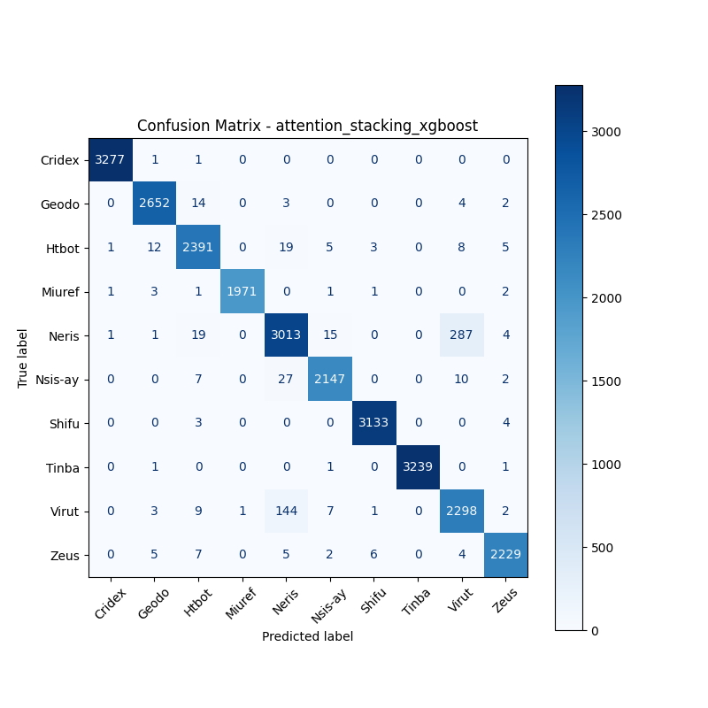

# 融合方式: attention+stacking (xgboost)

**Test Accuracy:** 0.9753

**Macro F1:** 0.9757

**分类报告:**

              precision    recall  f1-score   support

           0     0.9991    0.9994    0.9992      3279
           1     0.9903    0.9914    0.9908      2675
           2     0.9751    0.9783    0.9767      2444
           3     0.9995    0.9955    0.9975      1980
           4     0.9383    0.9021    0.9199      3340
           5     0.9858    0.9790    0.9824      2193
           6     0.9965    0.9978    0.9971      3140
           7     1.0000    0.9991    0.9995      3242
           8     0.8801    0.9323    0.9054      2465
           9     0.9902    0.9872    0.9887      2258

    accuracy                         0.9753     27016
   macro avg     0.9755    0.9762    0.9757     27016
weighted avg     0.9757    0.9753    0.9754     27016

**混淆矩阵:**

[[3277    1    1    0    0    0    0    0    0    0]
 [   0 2652   14    0    3    0    0    0    4    2]
 [   1   12 2391    0   19    5    3    0    8    5]
 [   1    3    1 1971    0    1    1    0    0    2]
 [   1    1   19    0 3013   15    0    0  287    4]
 [   0    0    7    0   27 2147    0    0   10    2]
 [   0    0    3    0    0    0 3133    0    0    4]
 [   0    1    0    0    0    1    0 3239    0    1]
 [   0    3    9    1  144    7    1    0 2298    2]
 [   0    5    7    0    5    2    6    0    4 2229]]

