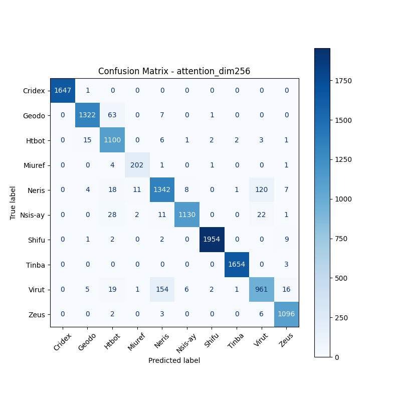
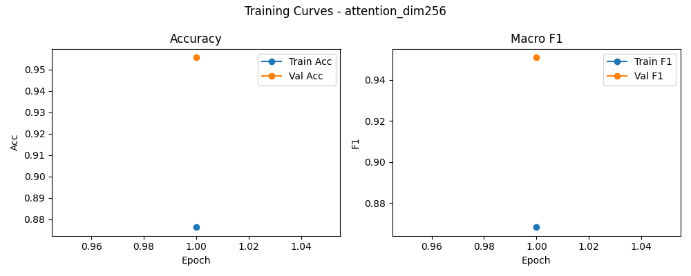

# 融合方式: attention

**Test Accuracy:** 0.9558

**Macro F1:** 0.9510

**分类报告:**

              precision    recall  f1-score   support

           0     1.0000    0.9994    0.9997      1648
           1     0.9807    0.9490    0.9646      1393
           2     0.8900    0.9735    0.9298      1130
           3     0.9352    0.9665    0.9506       209
           4     0.8794    0.8882    0.8838      1511
           5     0.9869    0.9464    0.9662      1194
           6     0.9969    0.9929    0.9949      1968
           7     0.9976    0.9982    0.9979      1657
           8     0.8642    0.8249    0.8441      1165
           9     0.9665    0.9901    0.9781      1107

    accuracy                         0.9558     12982
   macro avg     0.9497    0.9529    0.9510     12982
weighted avg     0.9563    0.9558    0.9557     12982

**混淆矩阵:**

[[1647    1    0    0    0    0    0    0    0    0]
 [   0 1322   63    0    7    0    1    0    0    0]
 [   0   15 1100    0    6    1    2    2    3    1]
 [   0    0    4  202    1    0    1    0    0    1]
 [   0    4   18   11 1342    8    0    1  120    7]
 [   0    0   28    2   11 1130    0    0   22    1]
 [   0    1    2    0    2    0 1954    0    0    9]
 [   0    0    0    0    0    0    0 1654    0    3]
 [   0    5   19    1  154    6    2    1  961   16]
 [   0    0    2    0    3    0    0    0    6 1096]]

